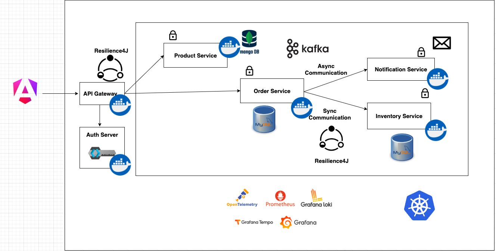

# Microservices Spring Boot Multi-Module Project

## Overview

This project is a microservices architecture built using Spring Boot, Docker, and several other tools for effective management, communication, and security between services. The system handles product cataloging, order processing, and inventory management, along with notifications for successful order placements via an event-driven architecture.

---

## Table of Contents
- [Microservices Overview](#microservices-overview)
- [Architecture Diagram](#architecture-diagram)
- [Tech Stack](#tech-stack)
- [Project Workflow](#project-workflow)
- [Setup and Installation](#setup-and-installation)
    - [Prerequisites](#prerequisites)
    - [Clone the Repository](#clone-the-repository)
    - [Environment Setup](#environment-setup)
    - [Docker Setup](#docker-setup)
- [Running the Application](#running-the-application)
- [API Endpoints](#api-endpoints)
    - [Product Service](#product-service)
    - [Order Service](#order-service)
    - [Inventory Service](#inventory-service)
- [Monitoring and Logging](#monitoring-and-logging)
- [Future Enhancements](#future-enhancements)
- [Contributors](#contributors)

---

## Microservices Overview

The project consists of the following Spring Boot microservices, each responsible for specific business functionality:

1. **Product Service**:
    - Manages product catalog using MongoDB.
    - Exposes endpoints to create and retrieve product data.

2. **Order Service**:
    - Handles order placements and interacts with the Inventory Service.
    - Uses MySQL for order data persistence.

3. **Inventory Service**:
    - Manages stock levels for products.
    - Uses MySQL for inventory data.

4. **Notification Service**:
    - Sends order confirmation emails using Kafka for event-driven communication.

5. **API Gateway**:
    - Routes incoming requests to respective services.
    - Secured using Keycloak for authentication and authorization.

6. **Eureka Discovery Service**:
    - Provides service discovery for all registered microservices.
    - Secured with simple OAuth (username and password).

---

## Architecture Diagram



---

## Tech Stack

- **Backend**: Java, Spring Boot
- **Messaging**: Apache Kafka
- **Service Discovery**: Eureka
- **Security**: Keycloak, OAuth
- **Resilience**: Resilience4J
- **Databases**: MongoDB (Product Service), MySQL (Order and Inventory Services)
- **Containerization**: Docker, Docker Compose
- **Orchestration**: Kubernetes (optional, in future)
- **Monitoring**: OpenTelemetry, Prometheus, Grafana, Grafana Loki

---

## Project Workflow

1. **Product Service**:
    - The `Product Service` manages product information and stores it in MongoDB.
    - Users can create products and view all products.

2. **Order Service**:
    - Handles order creation and communicates with the `Inventory Service` to check stock availability.
    - If the product is in stock, it places the order and stores the order details in the MySQL database.

3. **Inventory Service**:
    - Manages product stock levels.
    - Synchronously communicates with `Order Service` to ensure product availability before an order is

## Setup and Installation

### Prerequisites
Before setting up the project, ensure you have the following tools installed:

- **Docker**
- **Docker Compose**
- **Java JDK 11+**
- **Maven**
- **MySQL Workbench**
- **MongoDB**

### Clone the Repository
Clone the repository using the following commands:

```bash
git clone https://github.com/your-username/your-repo-name.git
cd your-repo-name

# Microservices Project

## Environment Setup

### Keycloak
Configure Keycloak for authentication and authorization. Import the Keycloak realm and client configurations into your Keycloak instance as per the setup provided in the [Keycloak Documentation](https://www.keycloak.org/documentation).

### Eureka
The Eureka server is secured with basic OAuth (username and password). Update the credentials in the configuration file.

## Docker Setup

### Dockerize the Services
Each microservice has already been dockerized using the Google Jib plugin for Spring Boot. No Dockerfile is required for individual services.

### Setup Docker Compose
The `docker-compose.yml` file includes configurations for:

- **MongoDB** (for Product Service)
- **MySQL** (for Order and Inventory Services)
- **Kafka and Zookeeper** (for Notification Service)
- **Kafka UI** for Kafka management
- **Keycloak** for authentication
- **Eureka Discovery Server**
- **API Gateway**

To start all the services with Docker Compose, run:

```bash
docker-compose up --build


# Microservices Project

## Running the Application

Once the setup is complete, you can access the services through the following endpoints:

- **Eureka Dashboard**: [http://localhost:8761](http://localhost:8761)  
  Username: `eureka`  
  Password: `password`

- **API Gateway**: [http://localhost:8080](http://localhost:8080)  
  All requests will be routed through the API Gateway, which is secured with Keycloak.

- **Kafka UI**: [http://localhost:8085](http://localhost:8085)  
  Access to Kafka topics, producers, and consumers for monitoring message flow.

- **Keycloak**: [http://localhost:8081](http://localhost:8081)  
  Manage roles, users, and client configurations.

## API Endpoints

### Product Service
- `GET /api/products` - Retrieve all products
- `POST /api/products` - Create a new product

### Order Service
- `POST /api/orders` - Place a new order
- `GET /api/orders/{id}` - Get order by ID

### Inventory Service
- `GET /api/inventory/{productId}` - Check stock availability for a product

## Monitoring and Logging

This project integrates **Prometheus**, **Grafana**, and **OpenTelemetry** for monitoring and logging:

- **Prometheus** collects metrics from the microservices.
- **Grafana** provides dashboards to visualize the metrics.
- **OpenTelemetry** captures distributed tracing for request flows between services.

To monitor the application:

- Access Grafana: [http://localhost:3000](http://localhost:3000)  
  View predefined dashboards for microservice performance, system health, and more.

## Future Enhancements

Here are some potential areas for future improvements:

- **Kubernetes Integration**: Deploy the microservices in a Kubernetes cluster for better scalability and orchestration.
- **CI/CD Pipeline**: Set up a CI/CD pipeline using GitHub Actions or Jenkins for continuous integration and deployment.
- **Caching**: Implement Redis or another caching solution to reduce load on the database for frequently accessed data.
- **Scaling Kafka**: Enhance Kafka’s scalability and resilience for handling a larger number of events.

## Contributors
- Rahul Kasana - [LinkedIn](https://linkedin.com/in/your-profile)
- Other Contributor Name(s) (if applicable)
